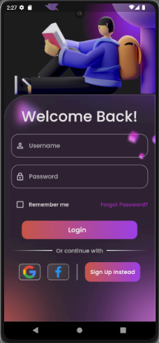
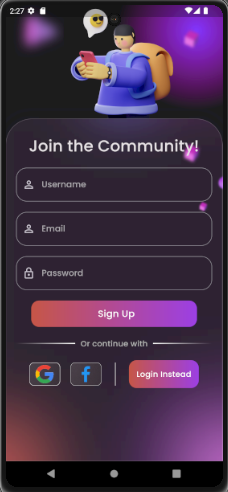

# Firebase Flutter Login Page (WinterHacks)

Welcome to the my WinterHacks submission for the Firebase task! This project is a Flutter application that provides a login page UI. The UI is connected to a firebase instance which allows users to login and register to the app using their email and google accounts.

Firebase part of the code can be found at:
```
{root}
├── lib                                
    ├── core
       ├── firebase_auth.dart         
```

## Table of Contents
- [System Requirements](#system-requirements)
- [Application Structure](#application-structure)
- [Release APK](#release-apk)

## System Requirements

Before getting started, make sure you have the following software installed:

- Dart SDK Version 2.18.0 or greater
- Flutter SDK Version 3.3.0 or greater

## Application Structure

After a successful build, the application should look like this:

<div style="display: flex;">
    <div style="flex: 50%;">
        <h2>Demo Login</h2>
        
    </div>
    <div style="flex: 50%;">
        <h2>Demo Signup</h2>
        
    </div>
</div>

## Release APK
A production reddy version of the APK is avilable for installing and using on Android, at:
```
{root}
├── APK                                
    ├── app-release.apk
```

